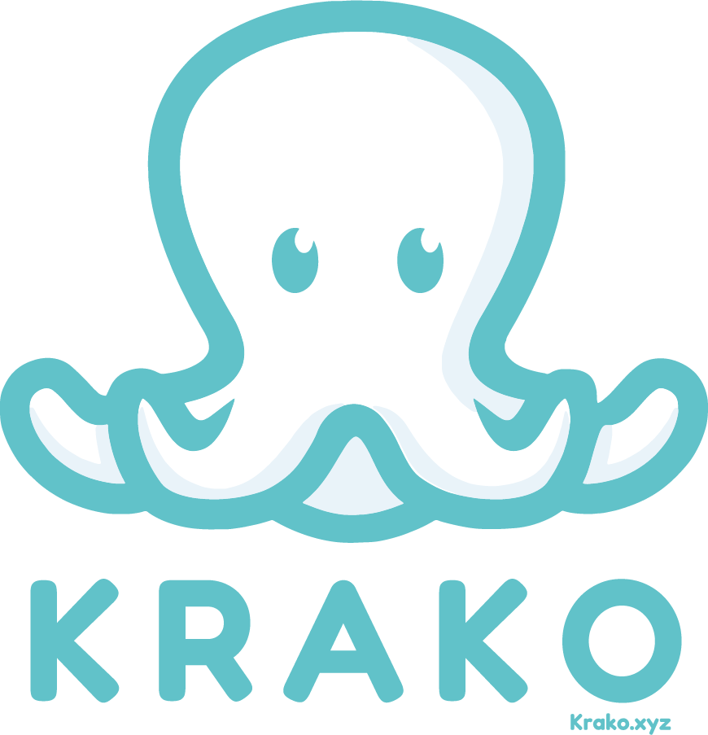
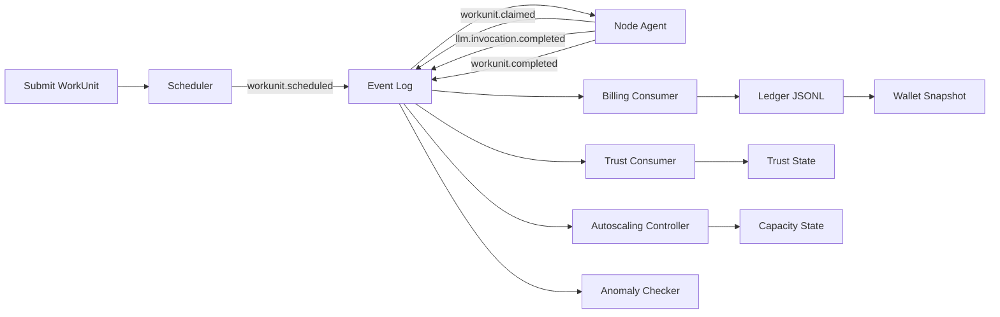
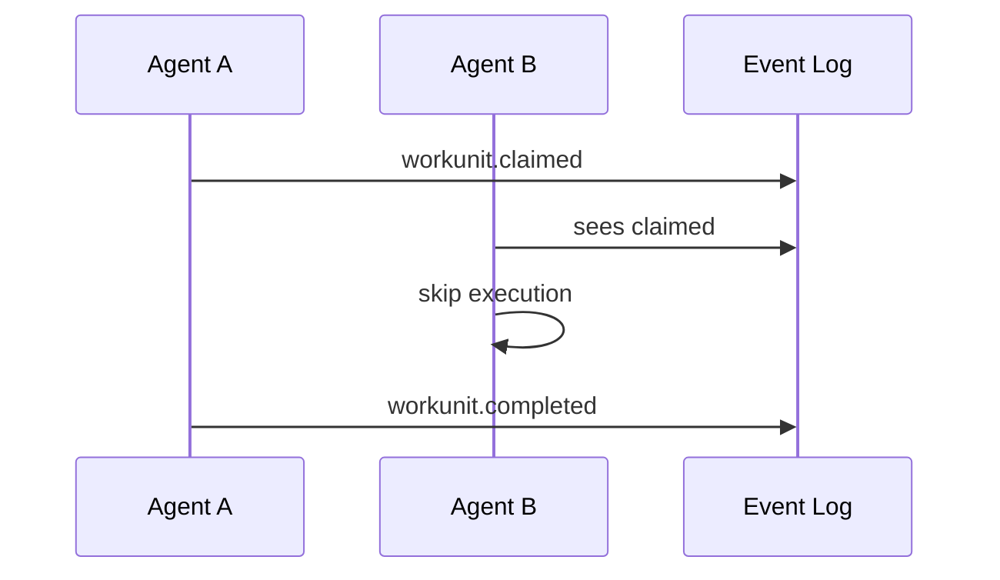
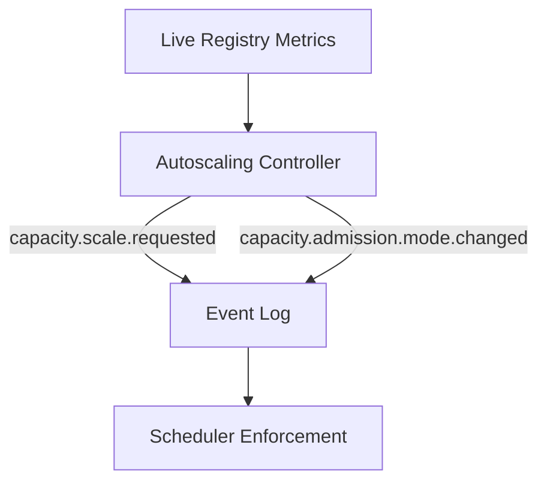

<p align="center">
  
</p>

<h1 align="center">Krako 2.0</h1>

<p align="center">
  <strong>Deterministic Distributed Execution Fabric for AI Workloads</strong>
</p>

<p align="center">
  
  
  
  
  
  
</p>

<hr>


# Overview

Krako 2.0 is an event‑sourced distributed execution framework designed specifically for AI workloads.

It provides:

• Deterministic multi‑agent execution  
• Replay‑safe billing (CPU + LLM tokens)  
• Claim‑based contention safety  
• Trust & heartbeat‑driven scheduling  
• Admission control (OPEN / THROTTLED / CRITICAL)  
• Logical autoscaling controller  
• Split line‑item billing architecture  

All built on an append‑only event backbone.

---

# 🧠 Core Philosophy

Krako 2.0 is not a simple task runner.

It is a deterministic execution fabric where:

• Every action is an event  
• Every cost is replayable  
• Every claim is deterministic  
• Every scale decision is traceable  
• Every ledger entry is idempotent  

System invariants:

• No double execution  
• No double billing  
• Replay produces identical financial state  
• Multi‑agent contention is safe  

---

# 🏗 System Architecture



---

# 🔄 Execution Lifecycle

## 1️⃣ WorkUnit Submission

A WorkUnit includes:

• kind (`cpu` | `llm_pod`)  
• execution_session_id  
• priority (p0, p1, p2…)  
• region  
• payload (prompt, tokens, etc.)  

Scheduler performs:

• Hard filter (supported_kinds, health, concurrency)  
• Weighted scoring (capacity, load, trust, region)  
• Anti‑affinity streak control  
• Admission enforcement (capacity mode)  

---

## 2️⃣ Multi‑Agent Contention Safety

Agents tail the same event log.

Before execution, each agent attempts to claim the work unit.



---

# 🤖 LLM Pod Execution

For `kind="llm_pod"`:

• Agent invokes LLM client (stub or OpenAI)  
• Emits:
  - `llm.invocation.completed`
  - `workunit.completed`

LLM provider selection:

```
KRAKO_LLM_PROVIDER=stub | openai
```

Invocation telemetry includes:

• tokens_in  
• tokens_out  
• total_tokens  
• latency_ms  
• provider  
• estimated_cost_usd  

---

# 💰 Deterministic Split Billing

Two billing line item types:

| line_item_type | Source Event                  |
|----------------|------------------------------|
| workunit_cpu  | workunit.completed           |
| llm_tokens    | llm.invocation.completed     |

Double charge prevention:

```
KRAKO_BILL_LLM_FROM_WORKUNIT_COMPLETED=0
KRAKO_BILL_LLM_FROM_INVOCATION=1
```

Ledger guarantees:

• Append‑only  
• Decimal precision (6dp)  
• Event‑id idempotent  
• Replay‑safe  

---

# 📈 Autoscaling & Admission

Capacity modes:

• OPEN  
• THROTTLED  
• CRITICAL  



---

# 🧪 E2E Demo

CPU burst example:

```
python scripts/e2e_demo.py --reset --burst 3 --polls 6
```

LLM stub example:

```
python scripts/e2e_demo.py --reset --kind llm_pod --polls 2 --llm-provider stub
```

Multi‑agent example:

```
python scripts/e2e_demo.py --reset --burst 1 --polls 2 --multi-agent
```

Autoscaling auto mode:

```
python scripts/e2e_demo.py --reset --simulate-pressure auto --burst 3 --polls 6
```

---

# 📂 Project Structure

```
src/krako2/
  agent/           # Execution loop + claim logic
  autoscaling/     # Capacity controller
  billing/         # Ledger + anomaly
  llm/             # LLM client abstraction
  scheduler/       # Placement + admission
  trust/           # Trust model
  storage/         # Event log backbone
scripts/
  e2e_demo.py
```

---

# 🚀 Status

Krako 2.0 is an actively developed distributed execution prototype designed to evolve into production‑grade AI infrastructure.

---

# 📜 License

Apache 2.0

